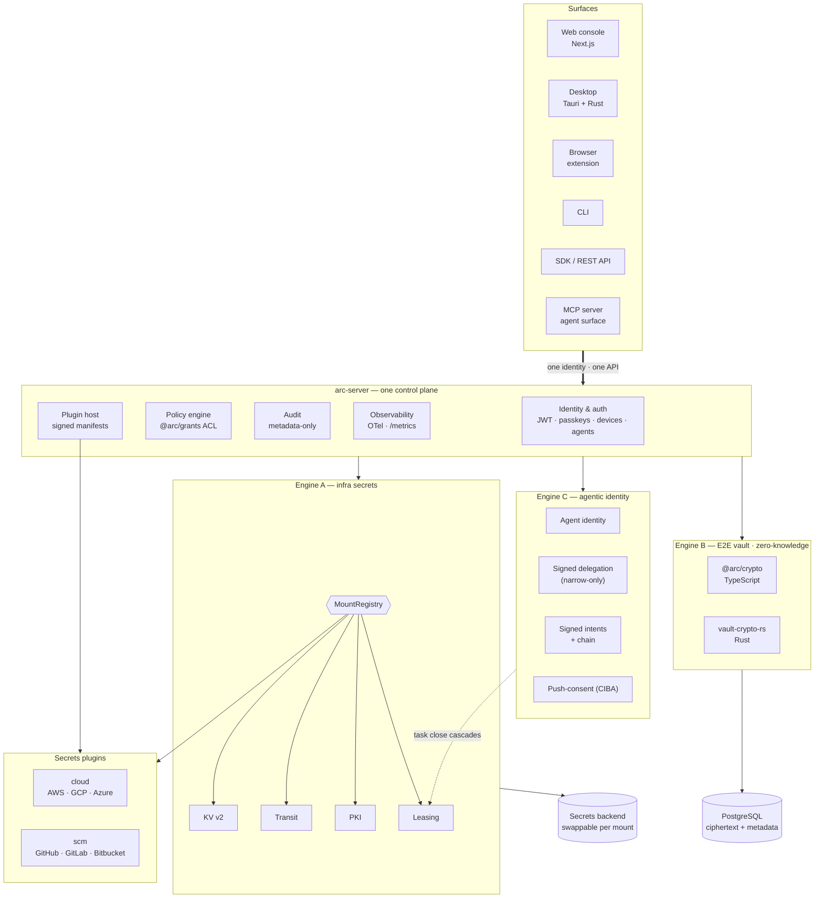
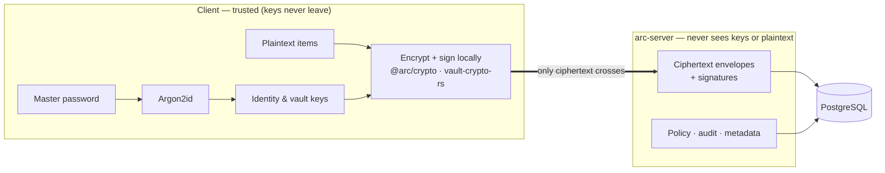

<div align="center">

# arc

**One self-hostable secrets platform — infrastructure credentials and an end-to-end-encrypted
vault — unified under one identity, one policy, one audit trail.**

[](https://github.com/ethchor/arc/actions/workflows/ci.yml)
[](https://github.com/ethchor/arc/actions/workflows/release.yml)
[](#zero-knowledge-by-architecture)
[](docs/arc-rfcs/ADR-002-post-quantum-hybrid-grants.md)
[](LICENSE)

[**Get started**](#get-started-in-60-seconds) &nbsp;•&nbsp;
[**Architecture**](#architecture-three-engines-one-control-plane) &nbsp;•&nbsp;
[**Docs**](#documentation) &nbsp;•&nbsp;
[**Roadmap**](docs/STATUS.md) &nbsp;•&nbsp;
[**Contributing**](CONTRIBUTING.md)

</div>

---

## What it does, in one paragraph

arc is one platform where **machine secrets** (dynamic database credentials, cloud STS tokens,
KV, transit encryption, PKI) and **human secrets** (passwords, passkeys, TOTP, notes, sharing)
live behind the same identity, policy, and audit pipeline. The server is **zero-knowledge** —
keys are derived on the client; only ciphertext crosses the trust boundary. Vault-key grants
are **post-quantum hybrid** by default (X25519 + ML-KEM-768). Autonomous agents are a
**first-class principal**: every action is a signed intent folded into a per-task cryptographic
chain that an owner can revoke in one shot. You can run all of it on your own infrastructure.

## Is this for you?

|                            | What you get                                                                                                                                                  |
| -------------------------- | ------------------------------------------------------------------------------------------------------------------------------------------------------------- |
| 🧑‍💼 **Platform engineer** | One control plane for KV, transit, PKI, dynamic cloud/SCM creds. Helm chart + Terraform module. OpenTelemetry traces, Prometheus `/metrics`, signed releases. |
| 👤 **Person / team**       | End-to-end-encrypted vault with passkey unlock, sharing, recovery, multi-device — works in browser, desktop (Tauri), CLI, and extension.                      |
| 🛠 **SDK / API integrator** | TypeScript + Go SDKs, REST API, signed-manifest plugin system, deterministic JCS-canonical wire format with a Rust verifier crate.                            |
| 🤖 **Agent / MCP builder** | First-class agent principals, signed narrow-only delegations, push-consent (CIBA) via passkeys, MCP server, RFC 8693 `act` claim out of the box.              |

## Get started in 60 seconds

> Requires **Node 22 or 24 LTS**, **pnpm 10**, and a Rust toolchain only if you touch
> `crates/`. Docker is optional (only the OpenBao-backed Engine A needs it). Full setup
> guide: **[SETUP.md](SETUP.md)**.

```sh
# 1. Install + build the workspace.
pnpm install
pnpm build

# 2. Run the API server. The dev fallback uses an in-memory DB + ephemeral JWT secret.
ARC_ENABLE_DEV_LOGIN=true pnpm --filter @arc/server start &
#   → arc-vault API listening on :3001

# 3. Run the web console in another shell.
pnpm --filter @arc/vault-web dev
#   → open http://localhost:3000

# Verify the server is up:
curl -s http://localhost:3001/metrics | head -2
```

That's it — open `http://localhost:3000`, click "create account" with any email, and you have a
fully functional end-to-end-encrypted vault running locally. **The server never sees the
master password or any plaintext.**

Want infrastructure secrets too? Boot OpenBao:

```sh
docker compose -f integrations/arc-openbao-adapter/docker-compose.yml up -d
export BAO_ADDR=http://127.0.0.1:8200 BAO_TOKEN=root
# restart the server — /v1/* is now live
```

## What's in the box

### 🔐 Engine A — Infrastructure secrets ([docs/14](docs/14-developer-platform.md))

- **KV v2** versioned secret storage with soft-delete + metadata
- **Transit** encryption-as-a-service (encrypt/decrypt/rotate without exposing keys)
- **PKI** X.509 issuance against a role-scoped CA
- **Dynamic credentials** for AWS, GCP, Azure, GitHub, GitLab, Bitbucket — issue-on-demand
  tokens with central lease tracking, renewal, and revocation
- Pluggable behind the `@arc/secrets-engine` contract — the reference backend is OpenBao,
  but the `MountRegistry` routes per-mount so backends can be swapped without a rewrite

### 🛡️ Engine B — End-to-end encrypted vault ([docs/03](docs/03-cryptographic-protocol.md))

- **Items**: passwords, TOTP/2FA, secure notes, generic secrets — encrypted client-side
- **Sharing & teams**: vaults with `owner / admin / editor / viewer` roles, plus
  [item-level sharing (ADR-007)](docs/arc-rfcs/ADR-007-item-level-sharing.md) — share one
  item with one user without granting vault membership
- **Multi-device**: each device gets its own hybrid (X25519 + ML-KEM) keypair and a
  verifiable approval code
- **Passkeys**: discoverable passkey unlock with WebAuthn PRF
  ([ADR-008](docs/arc-rfcs/ADR-008-passkey-residency-and-extension-unlock.md))
- **Recovery**: lose your master password, re-enroll under a new one without rotating
  identity ([ADR-006](docs/arc-rfcs/ADR-006-master-password-recovery.md)) — the server
  pins your public keys so recovery can never become account takeover
- **Tamper-evident**: signed per-vault mutation chain + signed vault head detect replay,
  rollback, and omission ([docs/10](docs/10-sync-consistency-and-integrity.md))

### 🤖 Engine C — Agentic identity ([ADR-005](docs/arc-rfcs/ADR-005-agentic-identity-engine-c.md))

- **Verifiable agent identity** — Ed25519 signing + ML-KEM hybrid identity per agent,
  optional SPIFFE / sigstore / TPM attestation, agent-as-policy-subject
- **Signed delegation that can only narrow** — decision = intersection of
  *delegated ∩ delegator-policy ∩ agent-policy*
- **Signed intents + per-task hash chain** — every action's `argsDigest` binds the body;
  agent signs `prevChainHead` so the server can't re-order accepted intents
- **Push-consent (CIBA) for elevated ops** — challenge derived from the intent digest
  itself, so a man-in-the-middle can't redirect the approval to a different intent
- **Per-agent token epoch** — `closeTask()` bumps the epoch and instantly revokes every
  outstanding JWT for the agent
- **MCP server** — exposes arc as Model Context Protocol tools for any MCP-capable agent

### 🖥️ Surfaces

Web console (Next.js) · Desktop (Tauri + Rust) · Browser extension (MV3, origin-bound autofill)
· CLI · TypeScript SDK · Go SDK · REST API · MCP server.

### 🧭 One identity, policy, and audit plane

- `@arc/grants` — path + capability ACL, groups/roles, **deny-by-default in production**
- Metadata-only audit log (server can't capture plaintext because it never sees it)
- OpenTelemetry traces + Prometheus `/metrics` built in

### 🚀 Ops & delivery

Helm chart · Terraform module · Kubernetes operator · signed + SBOM-attached container images
to GHCR · pre-push hook mirrors CI · 400+ tests across unit, e2e, Rust parity, helm lint,
Terraform validate, and Docker boot.

## Architecture — three engines, one control plane

`arc-server` (NestJS) unifies authentication, authorization, audit, and the plugin host. Every
request — human or agent — flows through the same identity and policy model.



### Zero-knowledge by architecture

Keys live with clients; the server is a blind ciphertext store. Only ciphertext crosses the
trust boundary.



The crypto runs identically in **TypeScript** (`@arc/crypto` — web/extension/CLI/server) and
**Rust** (`vault-crypto-rs` — desktop). The two implementations are verified byte-for-byte
against shared known-answer vectors, including a Rust→TS parity test that closes the reverse
direction.

## Monorepo orientation

pnpm workspaces + Turborepo, with **strict dependency boundaries** — nothing in `packages/`
imports anything from `apps/`, and plugins can only import `arc-plugin-sdk` and `arc-types`.

```
packages/      arc-types · arc-crypto · arc-grants · arc-leasing · arc-secrets-engine · arc-plugin-sdk
apps/          arc-server · arc-vault-web · arc-vault-desktop · arc-browser-extension · arc-cli · arc-operator
sdks/          arc-js-sdk · arc-go-sdk
plugins/       cloud/{aws,gcp,azure} · scm/{github,gitlab,bitbucket}
integrations/  arc-openbao-adapter · arc-mcp-server
crates/        vault-crypto-rs · desktop-core · arc-agent
infra/         arc-helm-charts · arc-terraform · arc-release
docs/          protocol specs · ADRs · manual-testing playbook · STATUS.md
```

The "where does code belong" map and dependency rules live in [`docs/CLAUDE.md`](docs/CLAUDE.md).

## Documentation

The full protocol & platform spec is a 16-part walkthrough in [`docs/`](docs/).

| Spec                                                                  |                                                                                       |
| --------------------------------------------------------------------- | ------------------------------------------------------------------------------------- |
| [01 Overview & goals](docs/01-overview-and-goals.md)                  | [09 API contract](docs/09-api-contract.md)                                            |
| [02 Threat model](docs/02-threat-model.md)                            | [10 Sync, consistency & integrity](docs/10-sync-consistency-and-integrity.md)         |
| [03 Cryptographic protocol](docs/03-cryptographic-protocol.md)        | [11 Audit, privacy & telemetry](docs/11-audit-privacy-and-telemetry.md)               |
| [04 Envelope & serialization](docs/04-crypto-envelope-and-serialization.md) | [12 Clients, sessions & extension](docs/12-clients-sessions-and-extension.md)   |
| [05 Identity keys & rotation](docs/05-identity-keys-and-rotation.md)  | [13 Passkeys & WebAuthn](docs/13-passkeys-and-webauthn.md)                            |
| [06 Enrollment, auth & devices](docs/06-enrollment-auth-devices.md)   | [14 Developer platform](docs/14-developer-platform.md)                                |
| [07 Vaults, RBAC & sharing](docs/07-vaults-rbac-and-sharing.md)       | [15 Testing, review & operations](docs/15-testing-review-and-operations.md)           |
| [08 Data model](docs/08-data-model.md)                                | [16 Roadmap & migration](docs/16-roadmap-and-migration.md)                            |

| Decisions & ops                                                |                                                                                                   |
| -------------------------------------------------------------- | ------------------------------------------------------------------------------------------------- |
| [Architecture Decision Records](docs/arc-rfcs/)                | One per consequential design call (language boundary, PQ hybrid, agentic identity, …)             |
| [Manual testing playbook](docs/manual-testing/)                | Step-by-step local bootstrap + per-feature scripts + release checklist                            |
| [STATUS.md](docs/STATUS.md)                                    | Live tracker: what's shipped, in-progress, and pending, updated every commit                      |
| [MONOREPO_PLAN.md](docs/MONOREPO_PLAN.md)                      | The full platform plan + phasing                                                                  |

## Testing & quality

Four layers, all run in CI on every PR.

| Layer            | What it covers                                                                                              | How to run                                                              |
| ---------------- | ----------------------------------------------------------------------------------------------------------- | ----------------------------------------------------------------------- |
| **Unit**         | Crypto, policy, leasing, plugins, wire shapes.                                                              | `pnpm test`                                                             |
| **End-to-end**   | Server + SDK flows: enroll → unlock → share → rotate, ACL enforcement, passkeys, dynamic creds, agents.     | `pnpm test` (boots the server on an in-memory DB)                       |
| **Rust parity**  | `vault-crypto-rs` produces identical ciphertext / signatures to `@arc/crypto` against shared KAT vectors.   | `cd crates/vault-crypto-rs && cargo test`                               |
| **Infra**        | Helm lint + template, Terraform validate, Docker image build + boot probe of `/metrics`, OpenBao adapter.   | CI jobs `helm`, `terraform`, `docker-build`, `openbao-adapter`          |
| **Manual**       | Cross-engine UX, browser passkey flows, "does this feel like one product."                                  | [`docs/manual-testing/`](docs/manual-testing/)                          |

A local **pre-push hook** (installed automatically on `pnpm install`) runs the same chain CI
does, so it's hard to push something that would go red.

## Contributing

Work lands on `develop` through pull requests from **category-prefixed branches** —
`feat/` `fix/` `ops/` `plugins/` `architecture/` `chore/` `design/` — one branch per area or
phase. The full convention, dependency rules, and review checklist live in
[`CONTRIBUTING.md`](CONTRIBUTING.md) and [`docs/CLAUDE.md`](docs/CLAUDE.md).

```sh
pnpm ci              # the exact chain CI runs: build → typecheck → test
pnpm hooks:install   # (re)install the pre-push hook
```

Contributors sign the [Contributor License Agreement](CLA.md). It grants the maintainers a
perpetual license to your contribution and explicitly allows future relicensing — you retain
copyright in your own work.

## License

Apache License 2.0 — see [`LICENSE`](LICENSE) and [`NOTICE`](NOTICE) for third-party
attribution. `integrations/arc-openbao-adapter` speaks only to the OpenBao HTTP API and contains
no copied or translated third-party engine source; that boundary is enforced inside the package
and documented in [`docs/CLAUDE.md`](docs/CLAUDE.md).
