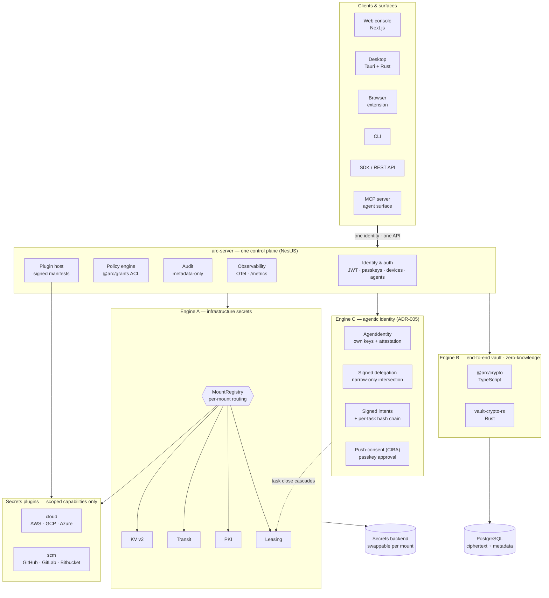
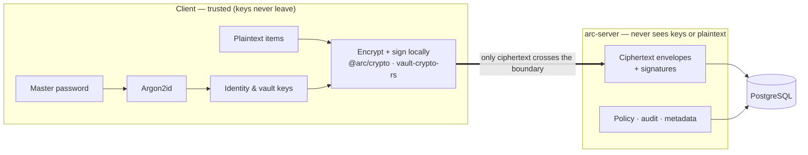
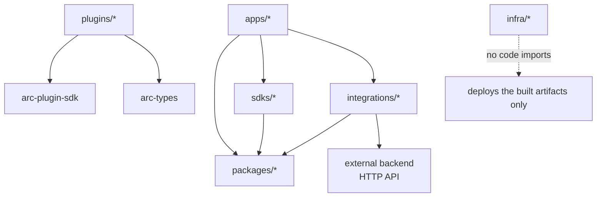

<div align="center">

# arc

**One self-hostable platform for infrastructure secrets *and* an end-to-end-encrypted vault —
unified under one identity, one policy model, one audit trail, one UI.**

[](https://github.com/ethchor/arc/actions/workflows/ci.yml)
[](https://github.com/ethchor/arc/actions/workflows/release.yml)
[](#testing--quality)
[](#architecture)
[](#why-arc)
[](https://www.typescriptlang.org)
[](#quick-start)
[](LICENSE)

</div>

---

arc is a secrets platform that stops treating *machine secrets* and *human secrets* as two
different problems. Your databases, your CI, your Kubernetes workloads, and your people all
authenticate to **one** system, governed by **one** policy engine, recorded in **one** audit
trail, and managed through **one** interface — whether that's the web console, the desktop app,
the browser extension, the CLI, or the API.

It is **zero-knowledge** where it counts: the server stores ciphertext and never sees a master
password, a derived key, a recovery key, or any plaintext. It is **post-quantum-aware** today,
not "on the roadmap." And it is built so that the next generation of **autonomous and intelligent
systems** can hold and use credentials as safely as a person can.

> **Status — shipping incrementally.** The infrastructure-secrets engine and the full end-to-end
> vault are working end-to-end across server, SDK, CLI, web, desktop, and browser extension.
> The live tracker is [`docs/STATUS.md`](docs/STATUS.md), updated every commit.

---

## Table of contents

- [What arc gives you](#what-arc-gives-you)
- [Architecture](#architecture)
- [Why arc](#why-arc)
- [Principles — the arc manifesto](#principles--the-arc-manifesto)
- [Quick start](#quick-start)
- [Testing & quality](#testing--quality)
- [For product owners](#for-product-owners)
- [Documentation](#documentation)
- [Contributing](#contributing)
- [Roadmap & north star](#roadmap--north-star)
- [License](#license)

---

## What arc gives you

### 🔐 Infrastructure secrets (Engine A)
Dynamic, short-lived credentials and encryption-as-a-service for your fleet.

- **Dynamic credentials** for cloud and SCM providers — issue-on-demand, auto-expiring tokens for
  **AWS, GCP, Azure, GitHub, GitLab, and Bitbucket**, with lease tracking, renewal, and revocation.
- **KV v2** versioned secret storage with soft-delete + metadata.
- **Transit** encryption-as-a-service (encrypt/decrypt/rotate without exposing keys).
- **PKI** — issue and revoke X.509 certificates against a role-scoped CA.
- **Leasing lifecycle** — every dynamic secret has a TTL, renew, and revoke path tracked centrally.
- **Pluggable** — the `SecretsPlugin` / `AuthPlugin` contracts let you add a new provider without
  touching the core. Plugins only ever receive scoped capabilities — never the vault master key.

### 🛡️ End-to-end-encrypted vault (Engine B)
A zero-knowledge vault for the humans and teams who run the infrastructure.

- **Items**: passwords, TOTP/2FA, secure notes, and generic secrets — encrypted client-side.
- **Sharing & teams**: vaults with role-based membership (owner / admin / editor / viewer)
  and **item-level sharing** ([ADR-007](docs/arc-rfcs/ADR-007-item-level-sharing.md)) —
  share *one item* with *one user* by `pqSeal`-wrapping its item key to the recipient's
  hybrid identity. Recipients decrypt that one item without becoming vault members or
  receiving the vault key.
- **Multi-device**: enroll devices with a verifiable code; each device gets its own keypair.
- **Passkeys**: unlock with WebAuthn (PRF) in addition to your master password.
  Registrations are **discoverable** ([ADR-008](docs/arc-rfcs/ADR-008-passkey-residency-and-extension-unlock.md)),
  so every surface (web, extension) supports **username-less unlock** — one biometric tap,
  zero typing.
- **Recovery**: a dedicated recovery flow ([ADR-006](docs/arc-rfcs/ADR-006-master-password-recovery.md))
  — lose your master password, re-enroll with your recovery key under a new one with **no
  change to your cryptographic identity** (every grant + share stays valid), and the server
  pins your public keys so recovery can never become account takeover.
- **Rotation**: rotate vault keys, identity keys, and devices independently.

### 🤖 Agentic identity (Engine C) — [ADR-005](docs/arc-rfcs/ADR-005-agentic-identity-engine-c.md)
A first-class principal type for AI agents with a *cryptographic* human→agent→action chain.

- **Verifiable agent identity** — every agent has its own Ed25519 signing + ML-KEM hybrid
  identity keypair, attaches to `@arc/grants` policies via an `agent:<id>` subject handle, and
  presents an optional **SPIFFE / sigstore / TPM attestation** behind a pluggable verifier.
- **Signed delegation that can only narrow** — a human signs a `DelegationGrant` (scopes,
  task id, expiry, call budget); the effective decision is the *intersection* of
  *delegated ∩ delegator-policy ∩ agent-policy*, so a delegation can never escalate authority
  the delegator lacks or accumulate beyond the agent's own ceiling.
- **Signed intents + per-task hash chain** — every action is an agent-signed intent whose
  `argsDigest` binds the body; intents fold into a `chainNext` per-task hash chain — a
  tamper-evident, replay/gap-detectable cryptographic record of what the agent did.
- **Push-consent (CIBA) for elevated ops** — elevated actions block until the owning human
  proves control with a **WebAuthn assertion** on a registered passkey; arc's CIBA, on its
  own passkey stack, no third-party IdP.
- **Task budgets + cascading revoke** — wall-clock / max-calls / max-secrets-unsealed per
  task; closing a task revokes every delegation **and** every Engine-A lease tagged with its
  id in one shot.
- **Self-authenticating agents** — challenge-response over the agent's signing key issues a
  short-lived JWT carrying the owner as `sub` plus the RFC 8693 `act: { sub: "agent:<id>" }`
  claim, so the on-behalf-of relationship is legible to standard OAuth tooling.
- **Signed plugin manifests** — plugin binaries (`.wasm` or OOP executables) only mount when
  their manifest pins the SHA-256 *and* names a publisher in the trust-anchor allowlist —
  tampered bytes or unknown signers refuse to spawn before any child is forked.
- **NHI inventory in the web console** — surfaces every agent: status, attestation,
  autonomy, last-seen, and quick controls for *toggle autonomy / suspend ↔ resume / retire*.

### 🧭 One identity, policy, and audit plane
- **Policy engine** (`@arc/grants`): path + capability ACLs, groups/roles, default-deny posture,
  with a cached, persisted policy store.
- **Audit**: metadata-only event log — programmatically guaranteed never to capture plaintext.
- **Observability**: OpenTelemetry traces + a Prometheus `/metrics` endpoint built in.

### 🖥️ Clients & surfaces
Web console (Next.js) · Desktop app (Tauri, keys held in Rust) · Browser extension with autofill ·
CLI · TypeScript SDK · REST API.

### 🚀 Ops & delivery
Helm chart · Terraform module · signed container images with SBOMs · OpenTelemetry + Prometheus ·
a CI matrix that builds, tests, and validates every surface on every change.

---

## Architecture

Three engines, one control plane. `arc-server` (NestJS) unifies authentication, authorization,
audit, and the plugin host; it routes every request — human or agent — through the same identity
and policy model.



**Engine A is backend-agnostic by design.** The `@arc/secrets-engine` contracts
(`KvEngine`, `TransitEngine`, `DynamicSecretsEngine`, `PkiEngine`, `MountRegistry`) describe
*what* a secrets backend does, not *who* implements it. Today the reference implementation is a
colocated [OpenBao](https://openbao.org) instance driven through its HTTP API by a thin adapter —
so arc inherits a battle-tested barrier, seal, and consensus layer for free while we build the
product *above* it. Because everything routes through `MountRegistry`, that backend is swappable
per mount: see [Roadmap & north star](#roadmap--north-star) for where this goes next.

**Engine B is arc's own zero-knowledge cryptosystem.** Keys are derived and used only on the
client; the server is a blind ciphertext store. Only ciphertext ever crosses the trust boundary:



The crypto runs identically in **TypeScript** (`@arc/crypto`, for web/extension/CLI) and **Rust**
(`vault-crypto-rs`, for desktop) — verified byte-for-byte against shared known-answer test vectors.

**Monorepo** (pnpm workspaces + Turborepo), with strict, enforced dependency boundaries — nothing
above the line may be imported by anything below it, and plugins are sandboxed to two packages:



```
packages/    arc-types · arc-crypto · arc-grants · arc-leasing · arc-secrets-engine · arc-plugin-sdk
apps/        arc-server · arc-vault-web · arc-vault-desktop · arc-browser-extension · arc-cli
sdks/        arc-js-sdk
plugins/     cloud/{aws,gcp,azure} · scm/{github,gitlab,bitbucket}
integrations/ arc-openbao-adapter · arc-mcp-server      crates/ vault-crypto-rs · desktop-core
infra/       arc-helm-charts · arc-terraform · arc-release
docs/        protocol specs · ADRs (ADR-001..008) · manual-testing playbook · STATUS.md
```

The canonical "where does code belong" map and the dependency rules live in
[`docs/CLAUDE.md`](docs/CLAUDE.md).

---

## Why arc

| | |
|---|---|
| **Modern primitives by default** | XChaCha20-Poly1305 (24-byte random nonces — no birthday-collision footgun), Argon2id (memory-hard KDF), X25519 + Ed25519, and RFC 8785 JCS canonical signatures. No hand-rolled crypto — every primitive is an audited `@noble/*` (TS) or RustCrypto (Rust) library. |
| **Post-quantum from day one** | Every vault-key grant is wrapped with an **X25519 + ML-KEM-768 hybrid** (X-Wing-style construction). Captured ciphertext stays safe even against a future quantum adversary — closing the harvest-now-decrypt-later window the same way Signal (PQXDH) and Apple iMessage (PQ3) did. |
| **The server holds nothing** | Zero-knowledge isn't a setting — it's the architecture. Back it up, snapshot it, subpoena it, or compromise it at rest: there are no keys and no plaintext to find. |
| **Tamper-evident, not just encrypted** | A signed per-vault mutation chain + signed vault head detect replay, rollback, and omission — not only row-level tampering. |
| **Keys in Rust, everything else in TypeScript** | Memory-zeroizing, constant-time Rust where key material lives; ergonomic TypeScript for the blind server and the product surface. Locked in an ADR so it isn't re-litigated by a drive-by PR. |
| **Built for machines, not just people** | Scoped capability tokens, machine identities, an agent, and a clean API mean automated and intelligent systems are first-class citizens — and never see a master key. |

Decisions that shouldn't be re-argued casually are written down as ADRs in
[`docs/arc-rfcs/`](docs/arc-rfcs/).

---

## Principles — the arc manifesto

1. **The server earns no trust it doesn't need.** It stores ciphertext and routes requests. Keys
   live with clients; plaintext never touches the database or process memory.
2. **One platform, one mental model.** Machine secrets and human secrets, one identity, one policy
   language, one audit trail. Unification is the product — not a pile of glue.
3. **Modern by default, future-proof by construction.** Strong primitives out of the box and
   post-quantum protection now, because "upgrade later" is how harvest-now-decrypt-later wins.
4. **No magic crypto.** Audited libraries, published constructions, known-answer vectors, and
   cross-language parity. If it can't be tested, it doesn't ship.
5. **No permanent lock-in — not even to ourselves.** Engines sit behind contracts and route per
   mount, so any backend (including our own) can be swapped in without a rewrite.
6. **Built for the agentic era.** Autonomous systems will need secrets too. They get scoped,
   auditable, revocable capabilities — never the keys to the kingdom.
7. **Self-hostable and auditable.** Your secrets platform should be something you can run, read,
   and verify end-to-end.
8. **Never push red.** A local pre-push hook runs the exact CI chain; `develop` stays green.

---

## Quick start

**Prerequisites:** Node ≥ 20, [pnpm](https://pnpm.io) 10.x, and (for the desktop crypto crate)
a Rust toolchain. Docker is optional — only needed to run the Engine-A backend locally.

```sh
# Install + build the whole workspace.
pnpm install
pnpm turbo run build

# Run the server (Engine B works standalone; uses an in-memory DB in dev).
JWT_SECRET=dev-only pnpm --filter @arc/server start          # → :3001

# Run the web console.
pnpm --filter @arc/vault-web dev                              # → :3000

# Optional: bring up the Engine-A backend for infra secrets.
docker compose -f integrations/arc-openbao-adapter/docker-compose.yml up -d
export BAO_ADDR=http://127.0.0.1:8200 BAO_TOKEN=root

# Optional: the CLI.
pnpm --filter @arc/cli build && node apps/arc-cli/dist/bin.js --help
```

In production, `arc-server` requires `DATABASE_URL` (Postgres) and `JWT_SECRET` and refuses to
boot without them. Deploy it with the **Helm chart** (`infra/arc-helm-charts`) or the **Terraform
module** (`infra/arc-terraform`); a tagged release publishes a **signed, SBOM'd container image**
to `ghcr.io/ethchor/arc-server`.

---

## Testing & quality

arc is tested at four levels — pick the one that matches what you're doing.

| Layer | What it covers | Run it |
|---|---|---|
| **Unit** | Crypto, policy, leasing, plugins, wire shapes. | `pnpm turbo run test` |
| **End-to-end** | Server + SDK flows: enroll → unlock → share → rotate, ACL enforcement, passkeys, dynamic creds. | `pnpm turbo run test` (boots the server on an in-memory DB) |
| **Rust parity** | `vault-crypto-rs` produces identical ciphertext/signatures to `@arc/crypto`, against shared KAT vectors. | `cd crates/vault-crypto-rs && cargo test` |
| **Live & infra** | Adapter against a real backend, Helm lint/template, Terraform validate, Docker image build + boot. | CI jobs `openbao-adapter`, `helm`, `terraform`, `docker-build` |
| **Manual** | Cross-engine UX, browser passkey flows, "does this feel like one product." | [`docs/manual-testing/`](docs/manual-testing/) |

**For testers:** start with [`docs/manual-testing/README.md`](docs/manual-testing/) for a
step-by-step local bootstrap and per-feature scripts, plus a release
[checklist](docs/manual-testing/). The automated suite (400+ tests across unit, e2e, Rust parity,
and infra) covers the wire shapes and boundaries; the manual playbook covers the cross-engine,
human-in-the-loop flows that are hard to assert in code.

CI runs the full matrix on every PR — Node build/typecheck/test, Rust parity, a live backend
smoke test, Helm + Terraform validation, and a Docker image build that boots the server and checks
`/metrics`. A local **pre-push hook** (installed on `pnpm install`) mirrors it, so it's hard to
push something that would go red.

---

## For product owners

- **What's shipped, in-progress, and pending** — [`docs/STATUS.md`](docs/STATUS.md), updated every
  commit, in implementation order.
- **The full platform plan + phasing** — [`docs/MONOREPO_PLAN.md`](docs/MONOREPO_PLAN.md).
- **Product vision, personas, and goals** — [`docs/01-overview-and-goals.md`](docs/01-overview-and-goals.md).
- **Release checklist** — [`docs/manual-testing/`](docs/manual-testing/).
- **Roadmap** — [`docs/16-roadmap-and-migration.md`](docs/16-roadmap-and-migration.md) and
  [below](#roadmap--north-star).

---

## Documentation

A 16-part protocol & platform spec lives in [`docs/`](docs/):

| | |
|---|---|
| [01 Overview & goals](docs/01-overview-and-goals.md) | [09 API contract](docs/09-api-contract.md) |
| [02 Threat model](docs/02-threat-model.md) | [10 Sync, consistency & integrity](docs/10-sync-consistency-and-integrity.md) |
| [03 Cryptographic protocol](docs/03-cryptographic-protocol.md) | [11 Audit, privacy & telemetry](docs/11-audit-privacy-and-telemetry.md) |
| [04 Envelope & serialization](docs/04-crypto-envelope-and-serialization.md) | [12 Clients, sessions & extension](docs/12-clients-sessions-and-extension.md) |
| [05 Identity keys & rotation](docs/05-identity-keys-and-rotation.md) | [13 Passkeys & WebAuthn](docs/13-passkeys-and-webauthn.md) |
| [06 Enrollment, auth & devices](docs/06-enrollment-auth-devices.md) | [14 Developer platform](docs/14-developer-platform.md) |
| [07 Vaults, RBAC & sharing](docs/07-vaults-rbac-and-sharing.md) | [15 Testing, review & operations](docs/15-testing-review-and-operations.md) |
| [08 Data model](docs/08-data-model.md) | [16 Roadmap & migration](docs/16-roadmap-and-migration.md) |

Plus [`docs/arc-rfcs/`](docs/arc-rfcs/) for architectural decision records and
[`docs/CLAUDE.md`](docs/CLAUDE.md) for the contributor map + dependency rules.

---

## Contributing

Work lands on `develop` through **pull requests** from **category-prefixed branches** —
`feat/…`, `fix/…`, `ops/…`, `plugins/…`, `architecture/…`, `chore/…`, and `design/…` (reserved for
UI/UX design) — one branch per area or phase, with the set open to new prefixes as the work calls
for them. CI must be green to merge. The full convention is in [`docs/CLAUDE.md`](docs/CLAUDE.md).

```sh
pnpm ci          # the exact chain CI runs: build → typecheck → test
pnpm hooks:install   # (re)install the pre-push hook; runs automatically on pnpm install
```

---

## Roadmap & north star

**Shipped recently** (tracked live in [`docs/STATUS.md`](docs/STATUS.md)):
the full **Engine-C agentic identity layer** ([ADR-005](docs/arc-rfcs/ADR-005-agentic-identity-engine-c.md))
— first-class agent principals, signed narrow-only delegations, signed-intent task chains
with cascading revoke, push-consent CIBA via passkeys, SPIFFE attestation, agent self-auth
with the RFC 8693 `act` claim, signed plugin manifests, and the NHI inventory in the web
console · the **MCP server** (`integrations/arc-mcp-server`) that exposes arc over the
[Model Context Protocol](https://modelcontextprotocol.io) · multi-device key rotation with
auto-revoke · out-of-process (WASM/gRPC) plugin sandbox.

**Near-term:** the Kubernetes operator for secret injection · the client-side agent for
auto-auth and templating · enforce-mode SVID cryptographic validation in the attestation
verifier · the runtime capability gate on plugins' declared `capabilities`.

**The engine north star.** Engine A's contracts are deliberately backend-agnostic and route per
mount, which makes the reference OpenBao backend an *implementation detail, not a dependency*. The
direction of travel is a **native arc secrets engine** behind those same contracts — a modern,
intelligent, self-contained core we own end-to-end, migrated mount-by-mount with zero big-bang
rewrite. We build the product first and earn the right to replace the foundation underneath it,
deliberately, when the leverage is there.

**The agentic north star.** The next wave of consumers isn't only humans and CI jobs — it's
autonomous and intelligent systems that need to hold, request, and rotate credentials continuously.
arc treats them as first-class principals **today**: every agent has a verifiable identity, every
delegation is signed and can only narrow, every action is an agent-signed intent folded into a
cryptographic per-task chain, elevation needs a passkey out-of-band, tasks close in one shot, and
every plugin's binary must trace back to a trusted publisher. The concrete agent surface is the
**MCP (Model Context Protocol) server** (`integrations/arc-mcp-server`): any MCP-capable agent
authenticates via the Engine-C credential path, receives a short-lived token carrying the RFC 8693
`act` claim, and calls arc operations — fetch a secret, mint a dynamic credential, encrypt via
transit — as MCP *tools*, each authorized by `@arc/grants` and recorded in the audit log, and
**never** handed the E2E master key. The point isn't that agents *can* use arc — it's that the
human→agent→action chain is a verifiable cryptographic artifact, not a stack of bearer tokens.

---

## License

arc is licensed under the **[Apache License 2.0](LICENSE)**. See [`NOTICE`](NOTICE) for
third-party attribution (bundled noble crypto, NestJS, TypeORM, OpenTelemetry, etc.).

Contributors sign the [Contributor License Agreement](CLA.md) — it grants the maintainers
a perpetual license to your contribution and explicitly allows future relicensing of the
project (e.g. to a source-available license like FSL or BSL 1.1 if/when the project needs
to defend against unrestricted hyperscaler resale of arc as a managed service). You retain
copyright in your own work; you're granting a license, not assigning ownership. See
[`CONTRIBUTING.md`](CONTRIBUTING.md) for the practical workflow.

The `integrations/arc-openbao-adapter` package speaks only to the OpenBao HTTP API and
contains no copied or translated third-party engine source — that boundary is enforced
inside the package and documented in [`docs/CLAUDE.md`](docs/CLAUDE.md).
